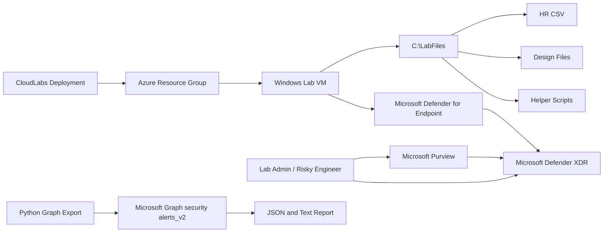

# Getting Started: Insider Threat Detection and Data Security Investigation

## Scenario

Zava Manufacturing suspects that a departing design engineer is collecting proprietary design files before leaving the company. In this lab, you are the security engineer assigned to configure Microsoft Purview Insider Risk Management, connect the investigation workflow with Microsoft Defender XDR, generate controlled evidence from the lab VM, hunt that evidence, conduct a Microsoft Purview investigation, and export Defender for Endpoint alert evidence with Microsoft Graph.

This lab is written for a fresh Microsoft 365 sandbox tenant. You should assume that the tenant starts with no useful incidents, alerts, device telemetry, audit history, sensitivity labels, app registrations, or named test users unless the deployment creates them locally on the lab VM or you create them during the challenges.

## Sign in and access your environment

Use the credentials supplied by CloudLabs throughout the lab.

1. Sign in to the Azure portal at <https://portal.azure.com>.
   - Username: <inject key="AzureAdUserEmail"></inject>
   - Password: <inject key="AzureAdUserPassword"></inject>
2. Confirm that you are working in tenant <inject key="TenantID"></inject> and subscription <inject key="SubscriptionID"></inject>.
3. Open the lab VM named **labvm-<inject key="DeploymentID" enableCopy="false"></inject>** from the CloudLabs environment page or from the Azure portal resource group provided for your deployment.
4. Use Microsoft Edge on the lab VM for the Microsoft 365 portals used in this lab.

> [!Important]
> The same lab admin account, <inject key="AzureAdUserEmail"></inject>, represents the departing Zava design engineer in the challenges. The deployment does not create separate Microsoft 365 user accounts.

## Portal prerequisites

You will use the following Microsoft portals. Keep them available as browser tabs on the lab VM.

| Portal | URL | Used for |
|---|---|---|
| Microsoft Purview portal | <https://purview.microsoft.com> | Insider Risk Management, data connectors, data sharing settings, and investigation work |
| Microsoft Defender portal | <https://security.microsoft.com> | Defender for Endpoint onboarding package, device inventory, incidents, alerts, and Advanced Hunting |
| Microsoft Entra admin center | <https://entra.microsoft.com> | Manual Microsoft Graph app registration fallback if the automated app registration is unavailable |
| Exchange admin center or Outlook on the web | <https://admin.exchange.microsoft.com> or <https://outlook.office.com> | Mailbox and outbound evidence generation steps |
| Azure portal | <https://portal.azure.com> | Lab VM and Azure resource visibility |

Your account must have administrative access to Microsoft Purview, Microsoft Defender, Microsoft Entra, Exchange/Outlook, and the Azure lab VM. Some Microsoft Purview features require explicit role group membership; being a Global Administrator does not automatically grant every Insider Risk Management operational role in the Purview portal.

## Lab overview

You will complete five challenges:

1. Configure Microsoft Purview Insider Risk Management with HR connector data.
2. Onboard the lab VM to Microsoft Defender for Endpoint, generate controlled activity, and enable Insider Risk Management data sharing to Defender XDR.
3. Hunt the generated activity with Advanced Hunting in Microsoft Defender XDR.
4. Conduct a Microsoft Purview investigation and document evidence.
5. Export Defender for Endpoint alert evidence by using Python and Microsoft Graph `/security/alerts_v2`.

The challenges are intentionally built around evidence that you create during the session. Do not expect historical alerts or incidents to exist in the tenant before you begin.

## Validation checkpoints

The lab guide contains one CloudLabs validation checkpoint in each challenge. The five canonical validation steps are:

1. `01-task-vm-readiness-and-lab-assets`
2. `02-task-defender-onboarding-telemetry-alert-and-alert-sharing`
3. `03-task-advanced-hunting-evidence`
4. `04-task-dsi-exported-evidence`
5. `05-task-graph-export-artifacts-and-alert-content`

These validations check VM-local assets, Defender for Endpoint onboarding and EICAR alert evidence, the Advanced Hunting notes file, real DSI or eDiscovery exported evidence under `C:\LabFiles\DSIExports`, and the final Microsoft Graph alert export files. Portal-only configuration choices such as the Purview data-sharing toggle are treated as manual facilitator-inspected tasks rather than automated pass conditions.

## Objectives

After completing this lab, you will be able to:

- Prepare a fresh Microsoft 365 tenant for Insider Risk Management investigation workflows.
- Import HR connector data that marks the lab admin account as a departing employee.
- Create an Insider Risk Management policy from the **Data theft by departing users** template.
- Onboard a Windows lab VM to Microsoft Defender for Endpoint using a tenant-specific onboarding package.
- Generate safe investigation signals from file movement, email activity, and the standard EICAR test file.
- Enable Microsoft Purview Insider Risk Management alert severity sharing to Microsoft Defender XDR.
- Use Advanced Hunting to locate endpoint, email, and alert evidence created during the lab.
- Build a Microsoft Purview investigation narrative from the evidence you generated.
- Query Microsoft Graph security alerts v2 and export case evidence.

## Architecture

### Component explanation

- **CloudLabs deployment** provisions the Azure lab VM and local lab assets.
- **Windows lab VM** is the workstation where you run PowerShell helper scripts, generate evidence, write Python code, and access the portals.
- **Microsoft Purview** is where you configure Insider Risk Management, the HR connector, data sharing, and the investigation workflow.
- **Microsoft Defender XDR** is where you onboard the VM to Microsoft Defender for Endpoint, view alerts, and use Advanced Hunting.
- **Microsoft Graph security alerts v2** is used in the final challenge to export Defender for Endpoint alert evidence.

## What the deployment creates

The deployment creates the following Azure and local VM artifacts for this lab:

### Azure resources

- A CloudLabs-supplied Azure resource group for your environment.
- A Windows lab VM named **labvm-<inject key="DeploymentID" enableCopy="false"></inject>**.
- VM networking resources required by the lab VM, such as a network interface, virtual network, subnet, network security group, and a public DNS/FQDN endpoint when remote access is required.
- A Custom Script Extension that bootstraps the VM, receives the CloudLabs deployment metadata including deployment ID <inject key="DeploymentID" enableCopy="false"></inject> and ODLID <inject key="ODLID" enableCopy="false"></inject>, and downloads common CloudLabs bootstrap assets from `https://experienceazure.blob.core.windows.net/templates/cloudlabs-common/`.

### Local VM folders and files

- `C:\LabFiles\ZavaHRData.template.csv` or `C:\LabFiles\ZavaHRData.csv`, containing the lab admin UPN as the departing employee when discoverable and two simulated colleague rows.
- `C:\LabFiles\ZavaDesignFiles\`, containing these design-engineering sample files:
  - `AeroFrame-Assembly-RevC.step`
  - `ZV-9000-Cooling-Manifold.dwg`
  - `Prototype-Test-Matrix.xlsx`
  - `Supplier-Costed-BOM-Q4.xlsx`
  - `Manufacturing-Tolerances.pdf`
- `C:\LabFiles\Prepare-ZavaLab.ps1`, a helper script that checks Python readiness, checks the `requests` and `msal` Python packages, attempts to identify the signed-in UPN, updates the HR CSV when needed, and prepares the evidence staging folder.
- `C:\LabFiles\Invoke-ZavaEicarTest.ps1`, a helper script that writes the standard EICAR test string so Microsoft Defender for Endpoint can raise a safe real alert after onboarding.
- `C:\LabFiles\get_insider_alerts.py`, a starter Python script for Microsoft Graph authentication and `/security/alerts_v2` export work.
- `C:\LabFiles\DSIExports\`, the folder where you save DSI or eDiscovery exported evidence in Challenge 4.
- `C:\LabFiles\config.json`, only if the best-effort Microsoft Graph app registration automation succeeds during deployment.

### Best-effort tenant automation

The deployment attempts to create a Microsoft Entra app registration for the final Microsoft Graph export challenge. When successful, it adds the Microsoft Graph application permission `SecurityAlert.Read.All`, grants admin consent if the deployment identity and tenant readiness allow it, and writes the resulting tenant ID, client ID, and client secret to `C:\LabFiles\config.json` on the lab VM.

Real Microsoft Graph client values are not placeholders, are not emitted as ARM template outputs, and are not published in deployment history. The VM-local files `C:\LabFiles\config.json` and `C:\LabFiles\GraphBootstrapStatus.json` are the only intended locations for bootstrap-created Graph client details, and those files contain real values only when the best-effort bootstrap succeeds.

This automation is best effort. If `C:\LabFiles\config.json` is missing or authentication fails, you will create the app registration manually in Challenge 5.

## What the deployment does not create

The deployment does not create or pre-stage the following items:

- Microsoft 365 user accounts other than the existing lab admin account.
- A tenant-specific Defender for Endpoint onboarding package.
- Microsoft Purview Insider Risk Management role group assignments.
- Microsoft Purview Insider Risk Management policies.
- Microsoft 365 HR connector configuration.
- Microsoft Purview data sharing settings for Defender XDR.
- Sensitivity labels or sensitivity label publishing policies.
- Microsoft 365 incidents, alerts, audit events, device telemetry, email evidence, or investigation cases.
- Any Azure auto-shutdown schedule, including a `Microsoft.DevTestLab/schedules` resource. CloudLabs lab-lifetime controls govern shutdown and cleanup for this environment.

## Fresh-tenant constraints and latency expectations

This lab is designed to be completed in a fresh tenant, but several Microsoft 365 security and compliance services are asynchronous. Use the following expectations while you work:

- **Unified audit logging** should be enabled early. Audit events accrue after auditing is enabled; events that happened before auditing was enabled might not be available.
- **Insider Risk Management permissions** can take time to appear in the Purview portal after you add yourself to the correct role group. If a page still shows access errors, sign out, close the browser, wait a few minutes, and sign in again.
- **HR connector imports** can take time to validate and process. The lab asks you to confirm the import result rather than assume it is instant.
- **Insider Risk Management alert scoring** is not expected to complete during the lab session. Microsoft Purview analyzes user activity over time, and alert generation can take 24 hours or longer depending on tenant readiness, data volume, and policy triggers.
- **Purview-to-Defender XDR sharing** is configured during the lab, but you should not wait for a correlated Insider Risk Management incident to appear in Defender XDR.
- **Defender for Endpoint onboarding and telemetry** can take several minutes after the onboarding package runs. The VM may not appear immediately in the Defender portal.
- **Advanced Hunting** data ingestion is not instant. If a query returns no rows immediately after you generate activity, wait a few minutes and retry with a wider time range.
- **Microsoft Graph security alerts v2** in this lab reads Defender for Endpoint alerts generated by your EICAR activity. It does not depend on an Insider Risk Management alert being generated in-session.
- **Sensitivity label exploration** in the investigation challenge is no-results-safe. The lab does not depend on newly published labels or a required labeled-content count.

## Before you begin the challenges

1. Confirm that you can sign in to the lab VM **labvm-<inject key="DeploymentID" enableCopy="false"></inject>**.
2. Confirm that you can open <https://purview.microsoft.com> and <https://security.microsoft.com> from Microsoft Edge on the VM.
3. Keep your lab admin UPN available: <inject key="AzureAdUserEmail"></inject>.
4. Remember that the lab admin account is both the administrator performing configuration and the departing Zava design engineer whose activity you investigate.

> [!Tip]
> If a portal prompts you to complete initial tenant setup or first-run activation, complete the required activation flow and then return to the lab instructions. Fresh Microsoft 365 security portals sometimes need a few minutes before all navigation items appear.
